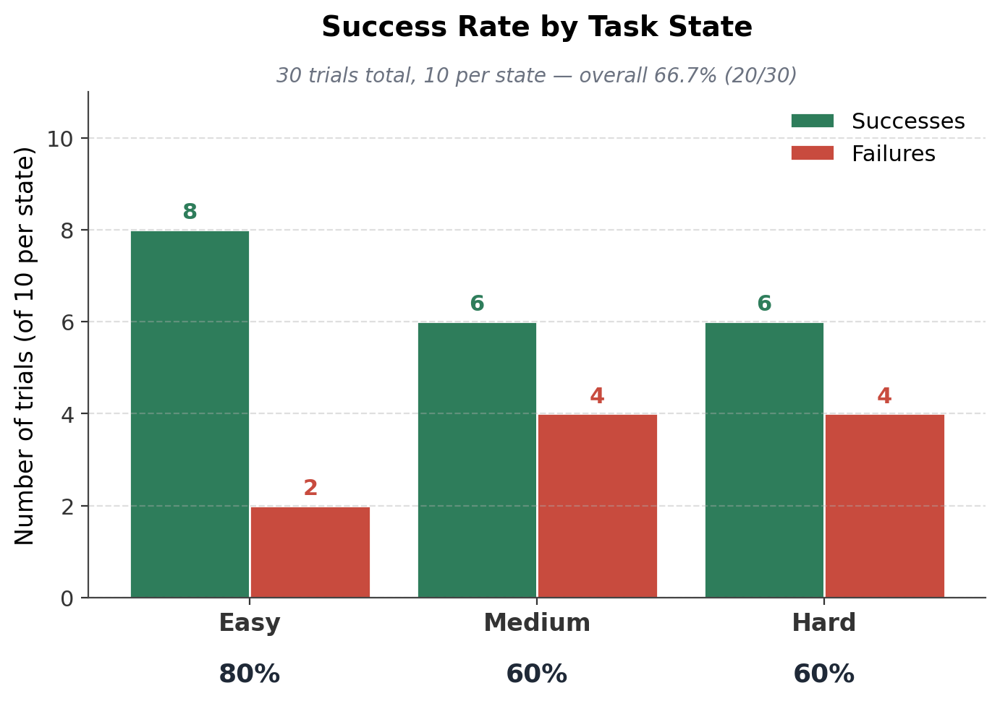
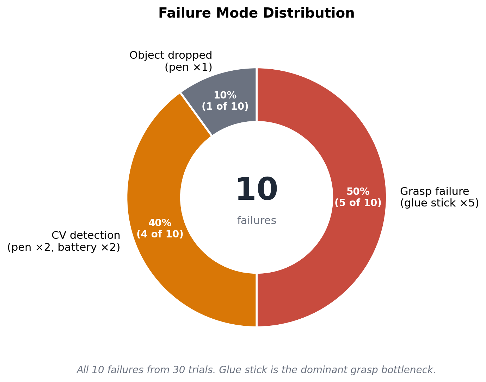
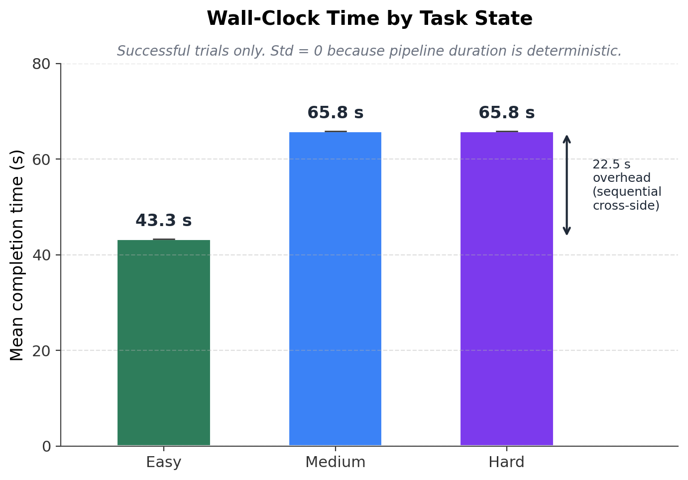

# Bi-Arm SO-101 Tabletop Sorting

> A hybrid Vision–IK–Learning pipeline for dual-arm object sorting on the SO-101 platform.

[](LICENSE)
[](https://www.python.org/)
[](https://pytorch.org/)
[](https://docs.ros.org/en/humble/)

**Authors**: Youqian Cui · Emmanuel Makinde
**Course**: TECHIN 517 — Hardware/Software Lab II (Spring 2026), University of Washington GIX
**Demo video**: [Google Drive folder](https://drive.google.com/drive/folders/1MmgWqGXMlzgtbEJmrmab4bkgX5aSRzkh?usp=sharing)

---

## Overview

A pair of SO-101 LeRobot arms cooperatively detect, pick, and sort 4 object classes from a tabletop into 2 category bins:

| Bin | Objects |
|---|---|
| **Electronics** | battery, earbuds case |
| **Stationery** | pen, glue stick |

Three task states parameterize scene complexity:

| State | Description | Bi-arm strategy |
|---|---|---|
| **Easy** | Stationery on left, electronics on right. No cross-midline objects. | Simultaneous bi-arm pick & place |
| **Medium** | 2 objects cross the midline. Cross-side handoff required. | Sequential cross-side + simultaneous same-side |
| **Hard** | Medium conditions + 2 distractor objects (keys, coins, etc.) | Same as Medium + CV rejection of distractors |

---

## Quick Start

```bash
git clone https://github.com/AAAYQ03/techin517-dual-arm-sort.git
cd techin517-dual-arm-sort
code .   # VS Code prompts "Reopen in Container" — click yes
```

Inside the container, after hand-eye calibration and ACT model download (see [Setup](#setup)):

```bash
# (Optional) Bring up ROS + MoveIt — used by the data-collection workflow
cd ros2_ws && source install/setup.bash
ros2 launch soa_moveit_config soa_moveit_bringup.launch.py

# Run dual-arm dispatch
bash dual_arm_full_dispatch.sh
```

---

## Quantitative Results

**30 trials total (10 per state). 66.7 % overall success. Zero safety incidents.**

| State | Success rate | Mean time (successful trials) |
|---|---|---|
| Easy | **80 %** (8/10) | 43.3 s |
| Medium | **60 %** (6/10) | 65.8 s |
| Hard | **60 %** (6/10) | 65.8 s |



### Failure mode breakdown

10 failed trials across 30, classified by responsible module:



- **Grasp failures (5)** — all on the cylindrical glue stick. Smooth, round geometry sits at the edge of the ACT training distribution.
- **CV detection failures (4)** — Grounding DINO miss on pen (×2) or battery (×2). Distributed across all states; not correlated with scene clutter.
- **Object dropped (1)** — pen slipped from gripper mid-transit.

### Wall-clock timing



- Easy is 22.5 s faster because both arms work in parallel on their own halves.
- Medium/Hard share the same time because cross-side handoff is the only sequential bottleneck; distractor rejection (Hard only) is handled by the CV stage and adds no time.
- Std = 0 because the pipeline uses fixed-duration ramps. CV failures terminate early at 43.0 s / 44.3 s.

Full per-trial data, the experimental protocol, and reproducibility scripts are in [`results/`](results/).

---

## Lessons Learned: v1 → v2 Improvements

After our final presentation, instructors identified two architectural issues with the v1 implementation. We've committed code-level fixes for both as v2.


### Issue 1: CV provided position only — orientation was missing


**v1 behavior**: CV produced `(x, y, z)`. IK used a fixed `wrist_roll`. For elongated objects like pens, the gripper was not aligned with the object's long axis, forcing ACT to compensate during the final grasp.

**v2 fix** ([`cv_module/orientation.py`](cv_module/orientation.py)): For each detection, we segment the object within its bbox via adaptive threshold + contour, fit a minimum-area rotated rectangle, and extract the principal axis angle. This angle is passed to IK as the target yaw.

**v2 IK change** ([`dispatch_pick.py`](dispatch_pick.py), [`dispatch_pick_f7.py`](dispatch_pick_f7.py)): Both dispatchers now expose `base_xyz_yaw_to_arm_joints(x, y, z, yaw, seed)`. When `yaw` is provided, `wrist_roll` is set to `(yaw − shoulder_pan) + π/2`, making the gripper perpendicular to the object's long axis. Symmetric objects (battery, earbuds case) pass `yaw=None` and retain v1 behavior.

This makes the responsibility split between stages much cleaner:

- **CV**: 6-D pose (3D position + yaw)
- **IK**: positions + orients
- **ACT**: final 5-cm fine-tuning (calibration drift, gripper closing dynamics)

### Issue 2: IK should reach the whole workspace; this is not a data problem


**v1 behavior**: We attributed position-edge grasp failures to insufficient ACT training data. The reviewer correctly pointed out that at the IK level, this is a coverage problem, not a data problem.

**v2 plan (architectural)**: 

1. **Workspace bound expansion**: v1 used `x ∈ (0.20, 0.28)`, `|y| < 0.10`. The SO-101 5-DOF arm geometrically reaches `x ∈ (0.16, 0.32)`, `|y| < 0.15`. v2 expands the filter accordingly.
2. **Multi-seed IK retry**: when the primary seed fails (returns out-of-range joints), retry with diverse seeds to avoid spurious failures from local minima in the geometric solver.

### Other improvements identified for future work

- **Closed-loop wrist-cam verification**: after the grasp, check the wrist camera to confirm the object is actually retained. Currently grasp success is assumed. Would catch the 5 glue-stick failures + the 1 pen drop.
- **Multi-view detection**: rotate `detect_home` 30° between attempts to handle edge-of-frame occlusions; would catch the 4 CV detection failures.

---

## Architecture

The full pipeline is a 6-stage hybrid:

```
 ┌──────────────────────────────────────────────────┐
 │ D435i RGB + Depth                                │
 │                                                  │
 │  Stage 1  Detection                              │
 │           Grounding DINO (open-vocab) → bboxes   │
 │             ↓                                    │
 │  Stage 2  Filtering                              │
 │           Color prior + bbox aspect-ratio prior  │
 │           CLIP fine-grained classifier           │
 │           IoMin dedup across class predictions   │
 │             ↓                                    │
 │  Stage 3  Dispatch                               │
 │           Assign picks to arms                   │
 │           Parallel / sequential schedule         │
 │             ↓                                    │
 │  Stage 4  Inverse Kinematics                     │
 │           lerobot_kinematics 5-DOF closed-form   │
 │           Smooth ramp → above-object pose        │
 │             ↓                                    │
 │  Stage 5  Grasp                                  │
 │           Per-(arm, object) ACT policy           │
 │           Final 5-cm grasp                       │
 │             ↓                                    │
 │  Stage 6  Delivery                               │
 │           IK to destination bin + release        │
 └──────────────────────────────────────────────────┘
```

### Design rationale

- **Why hybrid (not end-to-end ACT)?** Classical IK handles long-range positioning reliably; ACT handles the final 5 cm where calibration drift dominates. ACT's training distribution covers a much smaller volume → faster convergence (80k steps × 30 demos / object).
- **Why per-arm ACT?** The wrist-cam viewpoint is unique to each follower. A single ACT trained on f8 doesn't transfer to f7 (validated experimentally during development). Per-arm checkpoints add ~2 hours of training per object but eliminate this domain-gap issue.
- **Why 5-DOF geometric IK (not MoveIt)?** SO-101 is 5-DOF; MoveIt's KDL plugin only solves 5-DOF in "position-only" mode (no orientation constraint), which is unsuitable for grasp pre-positioning. We use `lerobot_kinematics` from `box2ai-robotics`, a 5-DOF closed-form solver written specifically for SO-101.
- **Why Grounding DINO + CLIP, not a fine-tuned classifier?** Open-vocab models generalize to new objects without retraining. CLIP is used for fine-grained electronics-vs-stationery disambiguation that DINO alone is unreliable on.

---

## Setup

### Hardware

- 2 × SO-101 LeRobot follower arms (`follower7`, `follower8`)
- 2 × SO-101 LeRobot leader arms (used only during data collection, not deployment)
- 1 × Intel RealSense D435i (overhead mount, centered between arms)
- 2 × USB wrist cameras (one per follower, mounted near gripper)
- Workstation: NVIDIA GPU ≥ 16 GB VRAM (tested on RTX 5090, 32 GB)

### Software via Dev Container (recommended)

The repo includes `.devcontainer/` for VS Code Dev Container reproducibility:

```bash
git clone https://github.com/AAAYQ03/techin517-dual-arm-sort.git
cd techin517-dual-arm-sort
code .
# When prompted, click "Reopen in Container"
```

The container ships with:

- PyTorch 2.7.1 + CUDA 12.8
- Python 3.10 + LeRobot + Transformers (Grounding DINO, CLIP)
- OpenCV, pyrealsense2, scipy
- ROS2 Humble + MoveIt2 + pymoveit2 (used by the data-collection workflow; not required for deployment)

Prerequisites on the host: Docker, VS Code with Dev Containers extension, NVIDIA Container Toolkit (for GPU), and `librealsense2` (for camera USB passthrough). On Linux, the `--privileged` + `/dev` bind mount in `devcontainer.json` handles USB device access.

> Hardware-in-the-loop deployment (ACT + RealSense + arm control) requires additional host configuration. The container is sufficient for code review, CV development, and ACT inference on sample images.

### Hand-eye calibration

Hand-eye calibration is **specific to your physical hardware** and must be redone:

- Our calibration values for `follower7` and `follower8` are in `calibration_follower7_record.txt` and `calibration_follower8_record.txt`.
- They are embedded in `ros2_ws/src/soa_ros2/soa_moveit_config/launch/soa_moveit_bringup.launch.py` as static TF publishers.
- The matrix-transform helpers in `recalc_calib.py` / `recalc_calib2.py` convert `easy_handeye2` calibration output (`base → optical`) into the `base → cam_link` form that ROS2 needs.

### Pre-trained ACT models

Six fine-tuned ACT checkpoints on Hugging Face Hub:

| Arm | Object | Hugging Face |
|---|---|---|
| f7 | pen | [ycui77/act_pen_f7](https://huggingface.co/ycui77/act_pen_f7) |
| f7 | glue stick | [ycui77/act_glue_f7](https://huggingface.co/ycui77/act_glue_f7) |
| f7 | battery | [ycui77/act_battery_f7](https://huggingface.co/ycui77/act_battery_f7) |
| f8 | pen | [ycui77/act_pen_f8_v1_final](https://huggingface.co/ycui77/act_pen_f8_v1_final) |
| f8 | battery | [ycui77/act_battery_f8](https://huggingface.co/ycui77/act_battery_f8) |
| f8 | earbuds | [ycui77/act_earbuds_f8](https://huggingface.co/ycui77/act_earbuds_f8) |

Download each into the path the dispatcher expects:

```bash
huggingface-cli download ycui77/act_pen_f7 \
    --local-dir outputs/train/act_pen_f7/checkpoints/last/pretrained_model/
# ... repeat for each model
```

Each model is trained for 80k steps × 30 demos with the ACT architecture (chunk_size=100). Loss converges to ~0.04 on the training set.

---

## Usage

### Full dual-arm sort (production entry point)

```bash
# (Optional) Bring up ROS2 + MoveIt for the data-collection workflow
cd ros2_ws && source install/setup.bash
sudo chmod 666 /dev/serial/by-id/* /dev/v4l/by-path/*
ros2 launch soa_moveit_config soa_moveit_bringup.launch.py

# Sequential dual-arm dispatch (f7 then f8)
bash dual_arm_full_dispatch.sh
```

### Smart dispatch (parallel where possible)

```bash
# Manual item specification per arm
python3 parallel_demo/dual_arm_smart.py \
    --f8items battery earbuds \
    --f7items pen glue

# Auto-assignment: detect all objects, dispatcher decides
python3 parallel_demo/dual_arm_smart.py --auto
```

### Single-arm dispatch (testing)

```bash
python3 dispatch_pick.py battery earbuds       # f8 only
python3 dispatch_pick_f7.py pen glue battery   # f7 only
```

### Reset between trials

```bash
python3 reset_to_safe_home.py
```

### Data collection (for retraining ACT)

CV+IK moves the follower to "above-object" pose, then leader-teleop records a 6-second grasp demo:

```bash
./do_one_demo.sh <object_name>      # f8
./do_one_demo_f7.sh <object_name>   # f7
```

See `pipeline_to_above_only.py` for the CV+IK step and `do_one_demo.sh` for the LeRobot record invocation.

---

## Repository Structure

```
techin517-dual-arm-sort/
├── .devcontainer/              # VS Code Dev Container config
│   └── devcontainer.json       #   References docker/Dockerfile
├── docker/                     # Dockerfile + container setup
├── cv_module/                  # Vision pipeline
│   ├── cv_module.py            #   Grounding DINO wrapper + depth sampling
│   └── orientation.py          #   [v2] PCA-based object orientation extraction
├── parallel_demo/              # Smart dispatcher
│   ├── dual_arm_smart.py       #   Parallel/sequential scheduler
│   └── auto_assign_helper.py   #   Auto-assignment by bbox coordinate
├── ros2_ws/src/                # ROS2 workspace (data-collection path)
│   ├── soa_ros2/               #   Our launch files, SRDF, hand-eye TF
│   └── pymoveit2/              #   MoveIt2 Python bindings (submodule)
├── results/                    # 30-trial quantitative evaluation
│   ├── trial_results.csv       #   Raw per-trial data
│   ├── failure_modes.csv       #   Aggregated failure analysis
│   ├── timing_stats.csv        #   Per-state timing statistics
│   ├── experiment_protocol.md  #   Full experimental protocol
│   └── plots/                  #   Publication-quality charts
├── calibration/                # Calibration tooling
├── data_collection/            # Data recording configs
├── scripts/                    # Misc utilities
├── dispatch_pick.py            # f8 single-arm dispatcher (v2 orientation-aware)
├── dispatch_pick_f7.py         # f7 single-arm dispatcher (v2 orientation-aware)
├── dual_arm_full_dispatch.sh   # Sequential f7 + f8 entry point
├── clip_classifier.py          # CLIP fine-grained classifier
├── pipeline_to_above_only.py   # CV+IK above-pose helper (data collection)
├── do_one_demo*.sh             # Data recording wrappers
├── leader_to_follower*.py      # Leader-arm pose mirroring
├── reset_to_safe_home.py       # Arm reset utility
├── calibration_*.txt           # Recorded hand-eye calibration values
├── LICENSE                     # Apache 2.0
└── NOTICE                      # Third-party attribution
```

---

## Team Contributions

### Youqian Cui

- Project planning and discussion
- Computer vision pipeline (Grounding DINO + CLIP + IoMin dedup + shape priors)
- ROS2 workspace, geometric IK, and hand-eye calibration
- Smart dispatcher (auto-assignment + parallel/sequential scheduling)
- ACT training — 200+ demos recorded
- System integration and debugging
- Evaluation — 30 main trials + 15 ancillary trials

### Emmanuel Makinde

- Project planning and discussion
- Hardware assembly (SO-101 arms, RealSense mount, wrist cameras)
- Workspace setup and object preparation
- Literature survey
- ACT training — 50+ demos recorded
- Compiled the evaluation results

---

## Known Limitations and Future Work

| Limitation | Observed effect | Future-work path |
|---|---|---|
| **Position-only CV in v1** | Pens and glue sticks need gripper alignment that ACT must learn | **v2 fix committed** in `cv_module/orientation.py`; needs hardware validation |
| **5-DOF reachability** | Some workspace edges are geometrically unreachable | Workspace expansion + multi-seed IK retry (v2 architectural plan, code-comment hooks in dispatchers) |
| **No closed-loop verification** | 5/10 failures are silent grasp failures (gripper closed but object slipped) | Add wrist-cam empty-gripper detection between pick and lift |
| **Single top-cam viewpoint** | 4/10 failures are CV mis-detections on small or partially-occluded targets | Multi-view: rotate `detect_home` 30° between attempts and merge detections |
| **Hand-coded CV thresholds** | Per-object DINO score, CLIP logit-scale, IoMin all tuned manually | Replace with VLA fine-tune (SmolVLA, π-0) to reduce per-object engineering |
| **Glue stick grasp** | 5/5 grasp failures, root cause: smooth cylinder geometry | Texture-aware ACT training; record additional demos with grip variations |
| **`dispatch_pick.py` and `dispatch_pick_f7.py` are sibling files** | ~95 % code duplication; per-arm config is hardcoded in each | Consolidate into one file with `--arm {f7,f8}` + YAML configuration |

---

## License

Apache License 2.0 — see [LICENSE](LICENSE).

This project incorporates code and models from several open-source projects (LeRobot, Transformers, Grounding DINO, CLIP, lerobot-kinematics, PyTorch, OpenCV, librealsense). See [NOTICE](NOTICE) for full attribution.

---

## Citation

If you use this code or our results in academic work:

```bibtex
@misc{cui2026biarm,
  author       = {Cui, Youqian and Makinde, Emmanuel},
  title        = {Bi-Arm SO-101 Tabletop Sorting: A Hybrid CV-IK-ACT Pipeline},
  year         = {2026},
  howpublished = {\url{https://github.com/AAAYQ03/techin517-dual-arm-sort}},
  note         = {TECHIN 517 Final Project, University of Washington GIX}
}
```
